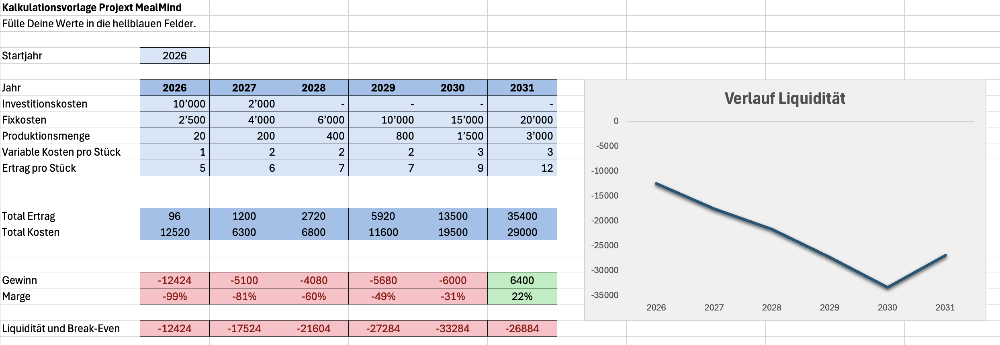

# [Home](../README.md)

# Angebot

## Beschreibung

Eine App, zum Lebensmittelbarcode scannen, Kalorie zählen und Menü planen. Mit automatischer Nährwert- und
Kalorie-berechnung und KI-powered Menu Planung bieten wir eine einfach-benutzbare, digitale Unterstützung zu allen
Aspekten der Ernährung.

### *Mind your meals*

## Kommunikation

Wir werden MealMind via benutzerfreundliche App anbieten, die im App Store verfügbar ist. Social-Media-Kanäle helfen
uns, die Vorteile von MealMind durch kurze Videos und Erfolgsgeschichten sichtbar zu machen. Kooperationen mit
Fitnessstudios, Ernährungsberater:innen und Influencer:innen sorgen für zusätzliche Reichweite. Ausserdem planen wir,
durch gezielte Anzeigenkampagnen neue Nutzer:innen zu gewinnen.

Die Kund:innen helfen beim Wachstum, indem sie Freund:innen einladen, Feedback geben und die App auf Social Media
teilen.
Die drei wichtigsten Kommunikationskanäle sind Instagram, TikTok und In-App-Notifications – alle mit Fokus auf
Motivation, Challenges und Community.
Weiterempfehlungen werden mit Premium-Tagen belohnt, um virales Wachstum zu fördern.

# Produktion beschreibung

## 1. Machen wir das selbst, kann es jemand anderes besser, wenn ja wer?

Wir entwickeln, betreiben und warten die App selbst, da das unsere Kernkompetenz ist.
Marketing und Design überlassen wir spezialisierten Partnern, die mehr Erfahrung im Branding und in der
Reichweitensteigerung haben.

## 2. Können wir gewisse Schritte zur Kundschaft auslagern?

Ja, Nutzer können durch Feedback, Beta-Tests und Einladungsaktionen aktiv zum Wachstum beitragen.
So werden sie Teil des Entwicklungs- und Marketingprozesses, ohne dass zusätzliche Kosten entstehen.

## 3. Können wir unsere Kernaktivitäten anders gestalten als üblich in der Branche?

Statt auf klassische Werbung setzen wir auf Community-Empfehlungen und organisches Wachstum.
Unsere App nutzt einfache Automatisierungen und KI-Erkennung, um den Aufwand für Nutzer zu reduzieren.

## 4. Was können wir der Kundschaft noch abnehmen, damit ihr Leben leichter und ihre Liebe zu uns grösser wird?

Auszeichnungen und Prämien motivieren zur Nutzung der App.

# Partner

## 1. High Performance Computing

Unser Produkt ist KI-basiert also brauchen wir dies.

## 2. Werbung

Dies ist nicht eine Stärke von uns also wäre dies etwas für einen Partner

# Ausgaben

## 1. Fixkosten

- Lizenzen für Software und Tools
- Server- und Hosting-Kosten
- Entwicklung umgebung und Infrastruktur
- Miete für Büroräume (falls erforderlich)

- Marketing- und Werbekosten

# Einnahmen

## 1. Abonnements

- Monatliche/Jährliche Abonnements für Premium-Funktionen
- Verschiedene Abonnementstufen (Basis, Premium, Familienplan) 3.95.-, 6.95.-, 12.95.- für Gruppe aus 3 Nutzer
- Kostenlose Testphase für Neukunden

## 2. Werbung

- In-App-Werbung für kostenlose Nutzer
- Partnerschaften mit Marken für gezielte Werbung

## 3. Einmalige Käufe

- Ernährungspläne basierte auf Kunden Ziele
- Rezeptpakete

# Kalkulation

## 2026 – Entwicklungsjahr

### Investitionskosten: 10 000 CHF

Private Rücklagen und Unterstützung durch Familie für erste Hardware, Design-Tools und Softwarelizenzen.

### Fixkosten: 2 500 CHF

Strom, Internet, kleine Cloud-Dienste und IDE-Lizenzen (z. B. JetBrains).

### Variable Kosten: 1 CHF pro Nutzer:in

Symbolische Testkosten für Beta-User (Hosting & Datenspeicherung).

### Kommentar:

Arbeit im Homeoffice, keine Miete. Fokus auf App-Grundarchitektur, Datenbankmodell und Prototyp-Entwicklung.
Erste interne Tests und Aufbau der Barcode-Scan- und KI-Erkennungslogik.

## 2027 – Testphase & erste reale Nutzung

### Investitionskosten: 2 000 CHF

Erweiterte Serverleistung und Marketing-Testkampagnen (Social Media Ads).

### Fixkosten: 4 000 CHF

Coworking-Space 1–2 Tage pro Woche, Hosting (20 CHF/Monat), Domain & API-Kosten.

Variable Kosten: 2 CHF pro Nutzer:in

Server- und API-Aufrufe steigen mit den ersten 200 realen Nutzer:innen.

### Kommentar:

Erste zahlende Kund:innen, beginnende Werbemassnahmen, Fokus auf Feedback und Stabilität.
Kleine Social-Media-Präsenz (Instagram, TikTok) zur Nutzergewinnung.

## 2028 – Stabilisierung & Optimierung

### Fixkosten: 6 000 CHF

Professionellere Infrastruktur (Monitoring, Backups, Security), erste Support-Kosten (z. B. Freelancer).

### Variable Kosten: 2 CHF pro Nutzer:in

Leichte Zunahme durch wachsende Userbasis (400 Nutzer:innen).

### Kommentar:

Noch keine vollen Löhne, aber kleine Entschädigung für Gründer:innen (~1 000 CHF/Monat ab Jahresmitte).
Fokus auf Performance-Optimierung, Automatisierung und Nutzerbindung.
App wird in App Stores eingereicht.

## 2029 – Wachstum & kleine Expansion

### Fixkosten: 10 000 CHF

Teilzeitkraft für Support & Marketing (~500 CHF/Monat), Hosting-Ausbau, Marketingbudget.

### Variable Kosten: 2 CHF pro Nutzer:in

Mehr Datentransfer, KI-API-Aufrufe und Speicherbedarf.

### Kommentar:

Community wächst auf ca. 800 Nutzer:innen. Grössere Werbeaktionen und Influencer-Kampagnen.
Gründer:innen zahlen sich je 1 500 CHF/Monat aus (Teilzeitniveau).

### Ziel:Strukturelle Vorbereitung für Wachstumsphase.

## 2030 – Professionalisierung & Skalierung

### Fixkosten: 15 000 CHF

Zwei Teilzeitstellen (Support + Marketing), besseres Cloud-Hosting (inkl. KI-API).
Zusätzlich Tools für Teamarbeit (Slack, Notion, GitHub Teams).

### Variable Kosten: 3 CHF pro Nutzer:in

Wachsende API- und Speicherkosten.

### Kommentar:

Umsatz steigt deutlich dank Premium- und Familien-Abos.
Die App wird professioneller, stabiler und bekannter.
MealMind Partner positioniert sich als ernstzunehmendes Produkt im Ernährungs-Tech-Markt.
Break-even noch nicht erreicht, aber defizit reduziert.

## 2031 – Erste Gewinne & Vorbereitung auf Break-even

### Fixkosten: 20 000 CHF

Drei Personen (zwei Gründer:innen + eine Teilzeitkraft), Marketing auf 1 500 CHF erhöht.
Keine teuren Büroräume – Arbeit bleibt hybrid mit flexiblen Coworking-Lösungen.

### Variable Kosten: 3 CHF pro Nutzer:in

Stabile Ausgaben, optimierte Infrastruktur und eigene KI-API-Integrationen.

### Kommentar:

Ertrag übersteigt erstmals die Gesamtkosten.
Jahresgewinn von ca. 6'400 CHF, entspricht etwa zwei durchschnittlichen Monatsgehältern.
Das Unternehmen arbeitet effizient und liquid – der Break-even wird realistisch im Folgejahr (2032) erreicht.
Fokus auf Nachhaltigkeit, Optimierung und Vorbereitung für GPU-basierte KI-Modelle.

## Fazit

- Entwicklung aus Eigenmitteln, schrittweiser Aufbau ohne Risiko-Kapital
- Fixkosten und Teamgröße bewusst klein gehalten
- Erste Gewinne im Jahr 2031, Break-even in Sichtweite
- Nachhaltige Wachstumsstrategie mit klarer Kostenkontrolle und organischem Marketing
