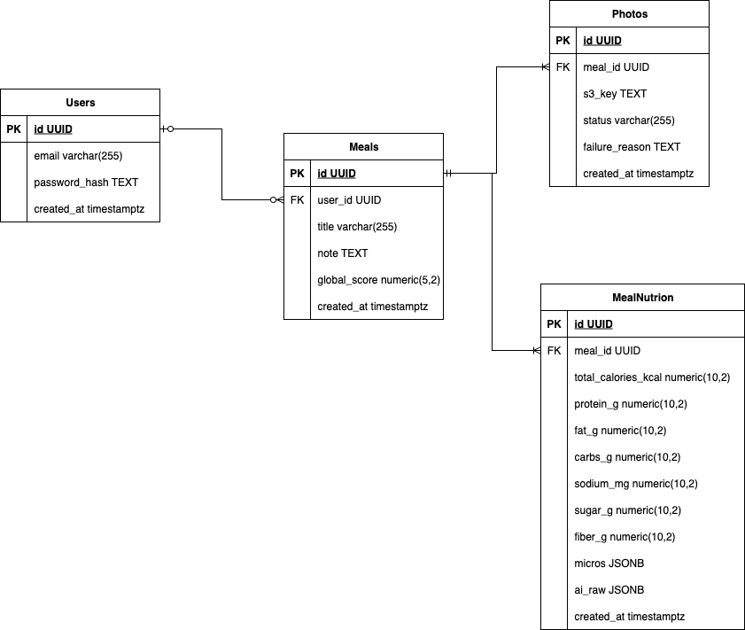
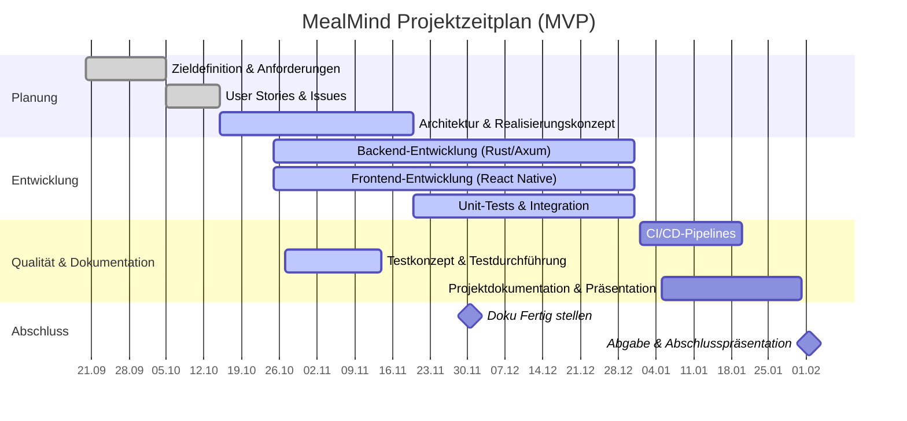

# [Home](../README.md)

# Realisierungskonzept (Kompetenz 1.3) — MealMind

## 1) Ziele und Nicht-Ziele

**Ziel (MVP):**  
Ein funktionierendes Anwendungssystem, das anhand eines oder mehrerer Fotos die Nährwerte eines Gerichts (Kalorien, Proteine, Fette) analysiert und eine Gesamteinschätzung des Gerichts von 0 – 10 liefert.  
Die App erstellt anschliessend für den Benutzer eine persönliche Ernährungsstatistik in Form von Tages- und Wochenübersichten.

**Nicht-Ziele (im MVP):**
- Exakte Gewichtserkennung der Portion.  
- Soziale Funktionen, Teilen oder Menü-Empfehlungen.  
- Eigene KI-Modelle (im MVP wird **OpenAI Vision** genutzt).

---

## 2) Architektur (High-Level)

- **Frontend (React Native)**  
  Mobile App für iOS/Android, ausschliesslich für Geräte.  
  Funktionen: Login, Fotoaufnahme (mehrere Fotos pro Mahlzeit möglich), Anzeige der Mahlzeiten und grafische Statistiken.  
  Die App kennt die Backend-URL, über die sie API-Requests ausführt.

- **Backend (Rust / Axum)**  
  Authentifizierung (JWT), Bereitstellung von Pre-Signed URLs, Upload-Bestätigung, Aufruf der OpenAI Vision API, Speicherung der Ergebnisse in PostgreSQL, Berechnung von Statistiken.  
  Der Backend-Endpunktname für die Upload-Bestätigung kann variieren (z. B. `/api/upload` oder `/photos/confirm`).

- **Datenbank (PostgreSQL)**  
  Speicherung von Benutzern, Fotos, analysierten Mahlzeiten und aggregierten Nährwertdaten.

- **Objektspeicher (MinIO)**  
  Verwendung eines lokalen, selbst gehosteten S3-kompatiblen Speichers (Open Source), um Fotos sicher zu speichern.

- **OpenAI Vision API**  
  Analyse der Fotos, um Nährwertdaten und eine Gesamteinschätzung zu liefern.

- **(Später) Warteschlange / Worker**  
  Für Skalierung und asynchrone Bildverarbeitung, sobald die Benutzerzahl steigt.

---

## 3) Ablauf (MVP – ohne Queue)

1. Die App fordert vom Backend eine Pre-Signed URL an (`POST /photos/presign`).  
   → Der React Native-Client weiss, wo sich das Backend befindet.  
2. Das Foto wird **direkt an MinIO** hochgeladen (anstelle von AWS S3).  
3. Die App meldet den Upload über `POST /photos/confirm` (oder gleichwertigen Endpoint).  
   Das Backend ruft **OpenAI Vision** auf, speichert die Analyse und Nährwerte in der Datenbank.  
4. Der Benutzer kann seine Daten über `/meals` oder `/stats` abrufen.  
   Die **Statistiken werden grafisch** dargestellt (z. B. Balken- oder Kreisdiagramme über gegessene Kalorien, Proteine, Fette …).

### Zukunft (mit Queue)
Später erfolgt die Analyse **asynchron**: Nach dem Upload wird der Datensatz mit Status `processing` gespeichert.  
Ein Worker verarbeitet die Fotos in einer Warteschlange (z. B. Redis / RabbitMQ) und aktualisiert das Ergebnis in der Datenbank.

**Analyseart im MVP:** synchron (Client wartet bis zu 10 – 20 Sekunden).  

---

## 4) Komponenten und Verantwortlichkeiten

| Komponente        | Verantwortung                                                               |
|-------------------|-----------------------------------------------------------------------------|
| **Auth**          | Registrierung, Login, Refresh, JWT-Signierung                               |
| **Photos**        | Pre-Signed URL, Upload, Statusverwaltung                                    |
| **VisionService** | Kommunikation mit OpenAI Vision, Parsing der Antworten                      |
| **Nutrition**     | Speicherung der Nährwertdaten (Kalorien, Protein, Fett, Gesamteinschätzung) |
| **Stats**         | Berechnung von Tages- und Wochenstatistiken, Ausgabe für Diagramme          |
| **Infra / CI/CD** | Docker, GitHub Actions, automatischer Deploy (Argo CD oder Server-Trigger)  |

---

## 5) Datenmodell (SQL – MVP)

## Sicherheitskonzept

Dieses Kapitel beschreibt **Authentifizierung & Autorisierung**, **Datenverschlüsselung** (in Transit & at Rest) sowie **Sicherheitsrichtlinien** inkl. proaktiver Massnahmen, Schwachstellen-Management und Notfallplanung.

### 1) Authentifizierung & Autorisierung

- **JWT (Access/Refresh)**
  - Access-Token: kurze TTL (z. B. 15 min), Refresh-Token: längere TTL (z. B. 7–14 Tage).
  - Signatur mit starkem Secret (mind. 32 Byte) oder Asymmetrie (z. B. EdDSA/ES256).
  - Claims: `sub` (User-ID), `iss`, `aud`, `exp`, `iat`, `kind` (access/refresh).
  - Token-Übermittlung per `Authorization: Bearer <token>`.
- **Passwörter**
  - Speicherung ausschliesslich gehasht (**Argon2**, moderner Memory-hard-KDF).
  - Minimale Passwortlänge (z. B. ≥ 8–12), optionale Pwned-Check/Entropie-Regeln.
- **Autorisierung**
  - Backend prüft JWT und ableitet Rechte (MVP: Benutzerrolle „user“).
  - Später erweiterbar (z. B. Rollen/Scopes).
- **Brute-Force & Abuse-Schutz  (Im Zukunft)**
  - **IP-basiertes Rate-Limiting** an der API (Login/Refresh/Upload enger drosseln).
  - Optional: Progressive Delays, temporäre Account-Sperre nach N Fehlversuchen.
- **CORS & Headers**
  - CORS auf bekannte App-Origins einschränken; Security-Header (HSTS, no-sniff).

### 2) Datenverschlüsselung

- **In Transit**
  - Ausnahmslos **TLS** (HTTPS) zwischen App ↔ Backend und Backend ↔ MinIO/OpenAI.
  - Strikte TLS-Konfiguration (moderne Cipher Suites), HSTS aktiv.
- **At Rest**
  - **PostgreSQL**: Datenträger/Volume-Verschlüsselung (z. B. LUKS/Cloud-Volume-Encryption).
  - **MinIO**: Serverseitige Verschlüsselung (SSE) aktivieren; Keys sicher verwalten.
  - **Backups**: Verschlüsselt ablegen (z. B. GPG/KMS), getrennt vom Primärsystem.
- **Secrets-Management**
  - Keine Secrets im Code/Repo. Nutzung von **GitHub Secrets** / ENV-Variablen.
  - Regelmässige Rotation von: JWT-Keys, DB-Creds, MinIO-Keys, API-Keys (OpenAI).

### 3) Zugriffskontrolle & Prinzipien

- **Least Privilege**
  - **DB-Zugänge**: 1× `root` (nur für Administration), **1× App-User mit minimalen Rechten** (nur CRUD auf benötigte Schemas/Tabellen).
  - MinIO: Bucket-Policies minimal halten; nur Pre-Signed URLs für Upload/Download.
- **Isolation**
  - Container ohne Root-User ausführen; Read-only Dateisystem, nur benötigte Ports.
  - Netzwerk-Policies (später/K8s): Backend darf nur zur DB/MinIO/OpenAI sprechen.
- **Eingabevalidierung**
  - Strikte Prüfung von Request-Bodies, **MIME-Type & Grösse** der Bilder (z. B. ≤ 8 MB).
  - HEIC → JPEG-Konvertierung auf dem Client oder kontrolliert im Backend.

### 4) Proaktive Sicherheitsmassnahmen

- **Code-Qualität**
  - CI: `cargo fmt`, `clippy -D warnings`.
  - **SAST**: Clippy-Regeln, optionale Erweiterungen.
- **Patch-/Update-Prozess**
  - Regelmässige Updates von Abhängigkeiten und Basis-Images (Alpine/Rust).
- **Logging & Monitoring**
  - Strukturierte Logs (keine PII/Secrets), Korrelation pro Request.
  - Metriken: Rate-Limit-Treffer, Fehlversuche Login, 4xx/5xx-Quoten, Latenzen.
- **Konfigurationshärtung**
  - CORS/Headers eingeschränkt, nur benötigte Endpunkte offen.
  - Pre-Signed URLs: kurze Gültigkeit (z. B. 5–10 Minuten).

### 5) Schwachstellen-Management

- **Prozess**
  - Eingehende Findings (Scans, Meldungen) triagieren → Priorisieren → Fix planen → Verifizieren → Dokumentieren.
  - **SLAs** vorschlagen: Kritisch ≤ 24–72 h, Hoch ≤ 7 Tage, Mittel/Niedrig zeitnah.
- **Transparenz**
  - Changelog/Release-Notes; Versionierung der Sicherheitsfixes (SemVer/Patch).
- **Tests**
  - Regressionstests für sicherheitsrelevante Bereiche (Auth, Upload, Parser).

### 6) Notfallplanung (Incident Response)

- **Erkennung & Alarmierung**
  - Alerts bei Anomalien (z. B. Login-Fehlerrate, plötzliche 5xx-Spikes).
- **Eindämmung**
  - **Tokens widerrufen** (Refresh-Liste/Key-Rotation), verdächtige Zugänge sperren.
  - Pre-Signed Policy verschärfen oder temporär deaktivieren (nur Admin-Upload).
- **Beseitigung & Wiederherstellung**
  - **Secrets rotieren** (JWT, DB, MinIO, OpenAI).
  - Systeme neu deployen (saubere Images); ggf. Read-only Modus.
  - **Wiederherstellen** aus **verschlüsselten Backups**; **Restore-Tests** regelmässig durchführen.
- **RPO/RTO**
  - Zielwerte festlegen (z. B. RPO ≤ 1 h, RTO ≤ 4 h) je nach Projektkontext.
- **Dokumentation**
  - Incident-Report (Ursache, Impact, Massnahmen), Lessons Learned, Präventionsplan.

### 7) Backup-Strategie

- **DB-Backups** regelmässig (z. B. min. täglich Inkremental + wöchentlich Voll).
- **Verschlüsselung** der Backups; getrennte Aufbewahrung (anderer Storage/Account).
- **Test der Wiederherstellung** (Restore-Drills) in Staging.
- **Aufbewahrungsfristen** definieren (z. B. 30/90 Tage) und dokumentieren.

## [Testkonzept](../docs/testkonzept.md)

## UI-Design-Spezifikationen (*Nora)

## Projektorganisation und Ressourcen

### Repository-Strategie

Es gibt **drei Repositories**:

| Repo                           | Zweck                      | Inhalt                                                                      | CI/CD-Regeln                                                                                    |
|--------------------------------|----------------------------|-----------------------------------------------------------------------------|-------------------------------------------------------------------------------------------------|
| **mealmind-main** (Haupt-Repo) | Zentrale Doku & Deployment | `docs/` (Realisierungs- & Testkonzept), `docker-compose.yml` für Deployment | Keine Image-Builds; optional Smoke-Checks. Wird für das Ausrollen der getaggten Images genutzt. |
| **mealmind-frontend**          | Mobile App (React Native)  | RN-Code, App-Build-Pipeline                                                 | **Push/PR:** Unit-Tests/Lint. **Tag:** Release-Build (App-Artefakte).                           |
| **mealmind-backend**           | Backend (Rust/Axum)        | Rust-Code, DB-Migrations, Dockerfile                                        | **Push/PR:** Lint/Unit-Tests/Build. **Tag:** Docker-Build & Push (GHCR).                        |

> Die Trennung in ein Haupt-Repo und zwei **separate Repos** (Frontend/Backend) dient der klaren Verantwortlichkeit, sauberem Lebenszyklus je Teilprojekt und einfacher Automatisierung. Das Haupt-Repo verweist auf die Service-Images per Tag und enthält die **docker-compose**-Definition für das Deployment.

### Workflow & Boards

- **Arbeitsweise:** Kanban-Board im Github mit Spalten *Todo → In Progress → In Review → Done*.  
- **Code Review:** primär **Selbstreview**; für Tasks in **Review** bestätigt die zweite Person per manueller Funktionsprüfung („durchklicken“), danach Verschiebung nach **Done**.  
- **Issues/Stories:** gepflegt im jeweiligen Service-Repo; das Haupt-Repo hält übergreifende Roadmap/Doku.

### CI/CD-Politik

- **Continuous Integration (alle Repos):**
  - **Push / PR:** Lint + Unit-Tests + (sofern sinnvoll) Build-Artefakte.
- **Continuous Delivery (nur bei Tags):**
  - **Backend:** Docker-Image wird **nur bei Tag** gebaut und in **GHCR** veröffentlicht.
  - **Frontend:** (optional) Release-Build nur bei Tag.
  - **Deployment:** Das **mealmind-main**-Repo enthält `docker-compose.yml`; Deploy zieht die **getaggten** Images (Backend) und startet/aktualisiert die Services.  
    (Alternativ: Argo CD kann auf neue Tags reagieren und den Rollout triggern.)

### Team & Rollen

- **Team:** Leonid Tsarov, Nora Sugden.  
- **Rollen (pragmatisch):** beide entwickeln Features; Reviews im 4-Augen-Prinzip beim Status **Review**.  
- **Kommunikation:** kurze Status-Syncs nach Bedarf; Entscheidungen/Doku im `docs/` des Haupt-Repos.

### Ressourcen

| Ressourcentyp                     | Beschreibung                                                                    |
|-----------------------------------|---------------------------------------------------------------------------------|
| **Quellcode & Versionskontrolle** | GitHub (3 Repositories wie oben)                                                |
| **CI/CD**                         | GitHub Actions; GHCR als Container Registry                                     |
| **Laufzeit & Storage**            | Docker-Host/Server; **MinIO** (S3-kompatibel) für Bilder; **PostgreSQL** als DB |
| **Secrets**                       | GitHub Secrets (JWT-Key, DB-Creds, MinIO-Keys, OpenAI-Key)                      |
| **Entwicklungsumgebung**          | VS Code / RustRover, Rust-Toolchain, Node/Expo (RN), Docker                     |
| **Tests**                         | Unit-Tests im Backend/Frontend; Smoke-Tests beim Deploy                         |
| **Backups**                       | Regelmässige DB-Backups (verschlüsselt), Restore-Tests in Staging/Dev           |

### Quality Gates

- **Backend (Rust):** `cargo fmt --check`, `clippy -D warnings`, Unit-Tests grün.  
- **Frontend (RN):** Lint/Tests grün.  
- **Release-Bedingung:** Tag nur nach erfolgreichem Review + grüner CI.  
- **Security-Checks (empfohlen):** `cargo audit` (Backend), Image-Scan (Docker) vor Release-Tag.

## Zeitplan mit Meilsteinen

## Risiken, Wartung und Support

### 1) Identifikation potenzieller Risiken

| Kategorie | Risiko | Beschreibung / mögliche Ursache | Gegenmassnahmen |
|------------|---------|---------------------------------|----------------|
| **Technologie** | Fehlende Stabilität oder Bugs in neuen Frameworks (Rust, Axum, React Native) | Da moderne Tools verwendet werden, können Bibliotheken oder Toolchains noch instabil sein. | Regelmässige Updates, Tests, Nutzung stabiler Versionen, Backup-Strategie. |
| **Integration (OpenAI)** | API-Änderungen, Rate Limits oder Kostensteigerung bei OpenAI. | Abhängigkeit von externem Dienst. | Caching, Rate-Limit-Handling, Fallback-Strategie, Dokumentation der Limits. |
| **Ressourcen** | Zeitmangel oder Ausfall von Teammitgliedern. | Projektarbeit neben Schule/Arbeit, begrenzte Zeitfenster. | Klare Planung, Priorisierung der Kernfunktionen, einfache MVP-Ziele. |
| **Infrastruktur** | Datenverlust oder Ausfall von MinIO/PostgreSQL. | Fehlerhafte Deploys, Hardware-Probleme. | Regelmässige, verschlüsselte Backups, Restore-Tests, Monitoring. |
| **Sicherheit** | Verlust oder Missbrauch von API-Keys / JWT-Secrets. | Unachtsamer Umgang mit Secrets, fehlende Rotation. | Nutzung von GitHub-Secrets, regelmässige Rotation, Zugriff nur für Admin. |
| **Skalierung** | Lange Antwortzeiten bei vielen Fotos / Nutzern. | Vision-Analyse ist rechenintensiv. | Einführung einer Warteschlange (Queue) und Worker-Prozesse nach MVP. |
| **Benutzerakzeptanz** | KI-Analyse liefert ungenaue Werte. | Vision-Modelle sind nicht 100 % exakt. | Transparente Kommunikation, manuelle Korrekturoption in Zukunft. |

---

### 2) Wartungs- und Supportkonzept

#### Wartungsplan
Nach dem **Go-Live** wird die Anwendung regelmässig gepflegt und verbessert:

| Bereich                | Aktivität                                                     | Frequenz / Auslöser                                   |
|------------------------|---------------------------------------------------------------|-------------------------------------------------------|
| **Software-Updates**   | Aktualisierung der Bibliotheken, Rust- und Node-Versionen.    | Quartalsweise oder bei sicherheitsrelevanten Patches. |
| **Sicherheits-Checks** | Überprüfung von Secrets und TLS.                              | Monatlich oder bei neuen Releases.                    |
| **Backups**            | Datenbank-Backup (verschlüsselt), Test-Restore.               | Täglich (automatisch) + Restore-Test monatlich.       |
| **Logs & Monitoring**  | Kontrolle von Logs (Fehler, API-Rate, Response-Zeit).         | Wöchentlich manuell + Alarme bei Auffälligkeiten.     |
| **Verbesserungen**     | Aufnahme von Nutzer-Feedback, Optimierung von UX/Performance. | Nach Bedarf (z. B. jede Iteration).                   |

---

#### Supportstruktur

| Aspekt                    | Beschreibung                                                                                       |
|---------------------------|----------------------------------------------------------------------------------------------------|
| **Support-Modell**        | Kein 24/7-Support (Schulprojekt), sondern regulärer Entwickler-Support durch das Projektteam.      |
| **Verantwortliche**       | Leonid Tsarov (Backend, Infrastruktur) und Nora Sugden (Frontend, UX).                             |
| **Kommunikation**         | Über GitHub-Issues oder direkte Abstimmung.                                                        |
| **SLA (informell)**       | Fehlerbehebung bei kritischen Problemen innerhalb von 1–3 Tagen (während aktiver Projektphase).    |
| **On-Call / Notfallplan** | Bei Ausfällen Zugriff auf Server und Backup-Skripte; Wiederherstellung aus verschlüsseltem Backup. |

Nach Projektabschluss ist kein offizieller On-Call-Support vorgesehen, aber das System bleibt dokumentiert und rekonstruierbar.

---

### 3) Release-Planung

| Phase                  | Beschreibung                                                                                                                 |
|------------------------|------------------------------------------------------------------------------------------------------------------------------|
| **Entwicklungsphase**  | Features werden in Feature-Branches umgesetzt und über Pull Requests gemerged.                                               |
| **CI-Phase**           | Bei jedem Push laufen Unit-Tests und Linter.                                                                                 |
| **Release-Phase**      | Nur bei **Git-Tag (vX.Y.Z)** wird ein Docker-Image gebaut und in GHCR veröffentlicht.                                        |
| **Deployment**         | Das Haupt-Repo enthält `docker-compose.yml`; beim neuen Tag zieht der Server automatisch das aktuelle Image und startet neu. |
| **Versionierung**      | SemVer (MAJOR.MINOR.PATCH); Changelog in `docs/changelog/V_x.y.z.md`.                                                        |
| **Post-Release-Tasks** | Überwachung nach Deployment, Kontrolle der Logs, kleiner Regressionstest.                                                    |

Nach dem MVP folgt eine Wartungs-Release-Phase, in der kleinere Verbesserungen (Queue, UI-Optimierungen, Performance-Tuning) nach Bedarf veröffentlicht werden.

---

