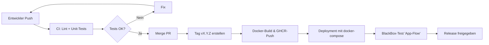

# [Home](../README.md)

# [Realisierungskonzept](realisierungskonzept.md)

# Testkonzept

## 1) Ziel des Testkonzepts

Das Ziel des Testkonzepts ist es, sicherzustellen, dass die Anwendung **MealMind** funktionsfähig, stabil, sicher und
wartbar ist.  
Alle Hauptfunktionen (Foto-Upload, Analyse, Speicherung und Statistiken) sollen unter realistischen Bedingungen korrekt
arbeiten.

### Testobjekt

Projekt: MealMind – mobile App (React Native) + Rust-Backend
Zweck: Barcode/Foto erfassen → KI-Analyse → Nährwerte/Statistiken anzeigen.
Funktionen (Scope v1): Registrierung/Login, Foto-Upload, KI-Auswertung (Mock/Live), Historie/Statistiken.
Einsatz: Mobile UX (Expo/APK), Backend via Docker Compose in Test/Prod.
(Sorgt für gemeinsames Projektverständnis, wie im Skript empfohlen.)

Es soll überprüft werden, ob:

- die KI-Auswertung korrekt ausgelöst wird,
- Daten richtig gespeichert und abgerufen werden,
- die App auf Fehler robust reagiert,
- Sicherheits- und Performanzanforderungen erfüllt sind.

---

## 2) Kritikalität der Funktionseinheiten

| Funktionseinheit                                            | Kritikalität | Begründung                                                                                                                                      |
|-------------------------------------------------------------|--------------|-------------------------------------------------------------------------------------------------------------------------------------------------|
| **Authentifizierung & Autorisierung (JWT, Login, Refresh)** | Hoch         | Kritischer Sicherheitsbereich: Zugriffsschutz auf alle sensiblen Endpunkte. Manipulierte oder gestohlene Tokens könnten Datenlecks verursachen. |
| **Foto-Upload & Analyse (OpenAI Vision)**                   | Hoch         | Zentrale Kernfunktion der App, rechenintensiv und potenziell fehleranfällig bei grossen Datenmengen.                                            |
| **Datenpersistenz (PostgreSQL / MinIO)**                    | Hoch         | Verlust oder Korruption der Daten würde das gesamte System unbrauchbar machen.                                                                  |
| **Statistiken & Anzeige (Frontend)**                        | Mittel       | Fehler wirken sich auf UX aus, beeinträchtigen aber nicht die Datensicherheit.                                                                  |
| **Registrierung / E-Mail-Funktion**                         | Niedrig      | Kann bei Problemen wiederholt oder manuell korrigiert werden.                                                                                   |

---

## 3) Verbindung zwischen User Stories und Tests

| User Story                                     | Wichtige Testfälle                                                                                                                                                                                                             | Testtyp                  |
|------------------------------------------------|--------------------------------------------------------------------------------------------------------------------------------------------------------------------------------------------------------------------------------|--------------------------|
| **#1 Registrieren & Anmelden**                 | **UT-01** Passwort-Hashing<br>**UT-02** JWT-Signatur/Verifizierung<br>**IT-01** Registrierung<br>**IT-02** Login<br>**IT-03** Refresh-Flow                                                                                     | Unit / Integration       |
| **#2 Lebensmittel erfassen (Meal erstellen)**  | **UT-03** Bild-Validierung/Hilfsfunktionen<br>**IT-04** `POST /meals` erstellt Eintrag + Status `pending`<br>**IT-05** KI-Analyse wird gestartet<br>**E2E-01** Kompletter Flow (Register → Login → Upload → Status → Ergebnis) | Unit / Integration / E2E |
| **#3 Nährwerte & Berechnung**                  | **IT-06** Speicherung der Nutrition-Daten<br>**IT-07** SQL-Aggregation Tages/Woche<br>**E2E-02** Anzeige der Statistiken im Frontend                                                                                           | Integration / E2E        |
| **#5 Sichere und benutzerfreundliche Nutzung** | **SEC-01** Zugriff ohne Token → 401<br>**SEC-02** Zugriff auf fremde Meal-ID verhindert<br>**UX-01** Blackbox-Test in der App                                                                                                  | Sicherheit / Manuell     |
| **#6 Framework-Grundstruktur**                 | **UT-04** Helper-Funktionen/Parser<br>CI-Lint/Build                                                                                                                                                                            | Unit / CI                |
| **#7 CI/CD-Pipeline & Deployment**             | CI-Pipeline-Run, Image-Build                                                                                                                                                                                                   | CI Automatisierung       |
| **#8 UI / Mockups**                            | **UX-02** Navigations- und Bedienungstests                                                                                                                                                                                     | Manuell                  |

---

## 4) Teststrategie

Die Teststrategie orientiert sich an der Testpyramide:

| Teststufe                     | Beschreibung                                                                             | Ziel / Umfang                                        |
|-------------------------------|------------------------------------------------------------------------------------------|------------------------------------------------------|
| **Unit-Tests**                | Einzelne Rust-Funktionen und Module werden getestet (z. B. JWT, Hashing, OpenAI-Parser). | Logische Korrektheit, keine I/O-Abhängigkeiten.      |
| **Integrationstests**         | Zusammenspiel zwischen API, Datenbank und externen Services (MinIO, OpenAI).             | Sicherstellen, dass Endpunkte korrekt funktionieren. |
| **End-to-End-Tests (E2E)**    | Vollständige User-Flows: Upload → Analyse → Anzeige in App.                              | Funktionale Prüfung aus Benutzersicht.               |
| **Manuelle Tests / Blackbox** | Tests durch Benutzer (manuelles Durchklicken in App).                                    | Validierung der Nutzererfahrung (UX).                |
| **Nicht-funktionale Tests**   | Performance-, Sicherheits- und Recovery-Tests.                                           | Stabilität, Antwortzeiten, Sicherheit.               |

---

## 5) Testumgebungen

| Umgebung                         | Zweck                   | Beschreibung                                          |
|----------------------------------|-------------------------|-------------------------------------------------------|
| **Lokale Dev-Umgebung**          | Entwicklung & Debugging | Rust lokal mit Docker-Compose (PostgreSQL + MinIO).   |
| **CI-Umgebung (GitHub Actions)** | Automatisierte Tests    | `cargo test`, `fmt`, `clippy`, ggf. Mock-Services.    |
| **Mobile Testgeräte**            | Endnutzer-Tests         | React Native App via Expo Go / APK auf iOS & Android. |

---

## 6) Testdaten & Vorbereitung

- **Unit-Tests:** synthetische Testdaten in Rust-Tests (z. B. Dummy-User, Mock-Token).
- **Integrationstests:** Testdatenbank mit Migrations und Seed-Skript (`migrations/test_seed.sql`).
- **E2E-Tests:** kleine, vordefinierte Fotos (z. B. 3 Beispielgerichte).
- **Mock-Services:** OpenAI-Aufruf wird teilweise simuliert, um Kosten zu vermeiden.

Testdaten dürfen keine realen Benutzerdaten enthalten.

---

## 7) Testfälle (Beispiele)

| ID         | Testfall                 | Beschreibung                                  | Erwartetes Ergebnis                         |
|------------|--------------------------|-----------------------------------------------|---------------------------------------------|
| **UT-01**  | Passwort-Hashing         | Prüfen von Hash → Verify                      | Hash korrekt, Verify OK                     |
| **UT-02**  | JWT-Signatur             | Signieren/Verifizieren                        | Claims korrekt                              |
| **IT-01**  | Registrierung            | Endpunkt aufrufen                             | 201 Created                                 |
| **IT-02**  | Login                    | Login gegen DB                                | 200 OK + Token                              |
| **IT-03**  | Meal erstellen + Analyse | `POST /meals` erstellen                       | Meal-ID zurück, Status = pending/processing |
| **E2E-01** | Vollständiger Flow       | Register → Login → Upload → Status → Ergebnis | App zeigt Analyse-Daten an                  |
| **E2E-02** | Refresh-Token-Flow       | Login → Refresh → Geschützter Endpunkt        | Zugriff erfolgreich                         |
| **E2E-03** | Fehlerhafte Eingaben     | Leeres Foto / beschädigt                      | Fehlercode, Analyse startet nicht           |

---

## 8) Testdurchführung

- **Automatisierte Tests (CI)**  
  Jeder Push und Pull-Request löst CI-Pipeline aus:
  ```yaml
  cargo fmt --check
  cargo clippy --all-targets -- -D warnings
  cargo test --all-features --lib
    ```

  Ergebnis: alle Tests müssen erfolgreich sein.

- **Manuelle Tests (App-Flow)**

  In Expo-Umgebung (React Native). Testplan:

    1. App starten
    2. Login / Registrierung durchführen
    3. Foto aufnehmen und hochladen
    4. Ergebnis prüfen
    5. Statistiken ansehen

  Tester: Leonid Tsarov und Nora Sugden (gegenseitige Review-Prüfung).

## 9) Testdokumentation

Die Testergebnisse werden dokumentiert:

- in GitHub Issues (bei Fehlern)
- in docs/testberichte/ als Markdown-Protokolle
- mit Screenshots (z. B. von Expo Go)

Beispiel Blackbox-Protokoll:

```markdown
# Blackbox-Test BB-01: Foto-Upload & Analyse

Datum: 2025-04-12  
Tester: Nora Sugden  
System: Expo Go auf Android, Backend v1.0.0

Schritte:

1. Login mit Benutzer `test@example.com`
2. Foto aufgenommen (Salat.jpg)
3. Upload durchgeführt
4. Ergebnis nach 13 s erhalten

Erwartet: Score > 0, Kalorien > 0  
Tatsächlich: Score = 8, Kalorien = 430 kcal  
Ergebnis: bestanden
```

## 10) Testfrequenz & Verantwortlichkeiten

| Testart                 | Verantwortlich | Frequenz                |
|-------------------------|----------------|-------------------------|
| Unit-Tests              | Beide          | bei jedem Push          |
| Integrationstests       | Beide          | bei jedem Merge / PR    |
| E2E-Tests (App)         | Beide          | vor jedem Release       |
| Manuelle Blackbox-Tests | Beide          | vor Go-Live             |
| Sicherheits-Tests       | Beide          | monatlich / vor Release |

## 11) Qualitätskriterien & Abnahmekriterien

Ein Release gilt als getestet und abgenommen, wenn:

- alle CI-Tests bestanden sind,
- manuelle Tests erfolgreich abgeschlossen sind,
- kritische Bugs (P0/P1) behoben wurden,
- Dokumentation aktualisiert ist.

Definition of Done (DoD):

- [ ] Lint + Tests grün
- [ ] Review durchgeführt
- [ ] Branch gemergt & Tag erstellt
- [ ] Docker-Image erfolgreich gebaut
- [ ] App getestet

## 12) Test- und Release-Prozess (Ablauf)



## 13) Testabschluss und Nachbereitung

Nach jedem Release wird ein kurzer Testbericht erstellt:

- Welche Tests durchgeführt wurden
- Ergebnisse / Abweichungen
- Gefundene und behobene Fehler
- Lessons Learned / Verbesserungen für nächsten Zyklus

Diese Berichte werden im Repo unter `docs/testberichte/` gespeichert.

## 14) Zusammenfassung des Testfortschritts

- **Abdeckungsgrad der Akzeptanzkriterien:** ca. **65 %** (Basisfunktionen vollständig, UI / KI-Teile folgen)
- **Testautomatisierung:** Unit + Integration Tests laufen in CI/CD-Pipeline
- **Ziel:** **70 % Abdeckung = Ideal**, ab **80 % = „Sehr gut / Exzellent“**
