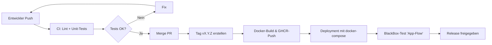

# [Home](../README.md)

# [Realisierungskonzept](realisierungskonzept.md)

# Testkonzept

## 1) Ziel des Testkonzepts

Das Ziel des Testkonzepts ist es, sicherzustellen, dass die Anwendung **MealMind** funktionsfähig, stabil, sicher und
wartbar ist.  
Alle Hauptfunktionen (Foto-Upload, Analyse, Speicherung und Statistiken) sollen unter realistischen Bedingungen korrekt
arbeiten.

Es soll überprüft werden, ob:

- die KI-Auswertung korrekt ausgelöst wird,
- Daten richtig gespeichert und abgerufen werden,
- die App auf Fehler robust reagiert,
- Sicherheits- und Performanzanforderungen erfüllt sind.

---

## 2) Teststrategie

Die Teststrategie orientiert sich an der Testpyramide:

| Teststufe                     | Beschreibung                                                                             | Ziel / Umfang                                        |
|-------------------------------|------------------------------------------------------------------------------------------|------------------------------------------------------|
| **Unit-Tests**                | Einzelne Rust-Funktionen und Module werden getestet (z. B. JWT, Hashing, OpenAI-Parser). | Logische Korrektheit, keine I/O-Abhängigkeiten.      |
| **Integrationstests**         | Zusammenspiel zwischen API, Datenbank und externen Services (MinIO, OpenAI).             | Sicherstellen, dass Endpunkte korrekt funktionieren. |
| **End-to-End-Tests (E2E)**    | Vollständige User-Flows: Upload → Analyse → Anzeige in App.                              | Funktionale Prüfung aus Benutzersicht.               |
| **Manuelle Tests / Blackbox** | Tests durch Benutzer (manuelles Durchklicken in App).                                    | Validierung der Nutzererfahrung (UX).                |
| **Nicht-funktionale Tests**   | Performance-, Sicherheits- und Recovery-Tests.                                           | Stabilität, Antwortzeiten, Sicherheit.               |

---

## 3) Testumgebungen

| Umgebung                         | Zweck                   | Beschreibung                                          |
|----------------------------------|-------------------------|-------------------------------------------------------|
| **Lokale Dev-Umgebung**          | Entwicklung & Debugging | Rust lokal mit Docker-Compose (PostgreSQL + MinIO).   |
| **CI-Umgebung (GitHub Actions)** | Automatisierte Tests    | `cargo test`, `fmt`, `clippy`, ggf. Mock-Services.    |
| **Mobile Testgeräte**            | Endnutzer-Tests         | React Native App via Expo Go / APK auf iOS & Android. |

---

## 4) Testdaten & Vorbereitung

- **Unit-Tests:** synthetische Testdaten in Rust-Tests (z. B. Dummy-User, Mock-Token).
- **Integrationstests:** Testdatenbank mit Migrations und Seed-Skript (`migrations/test_seed.sql`).
- **E2E-Tests:** kleine, vordefinierte Fotos (z. B. 3 Beispielgerichte).
- **Mock-Services:** OpenAI-Aufruf wird teilweise simuliert, um Kosten zu vermeiden.

Testdaten dürfen keine realen Benutzerdaten enthalten.

---

## 5) Testfälle (Beispiele)

| ID         | Testfall            | Beschreibung                               | Erwartetes Ergebnis                                           |
|------------|---------------------|--------------------------------------------|---------------------------------------------------------------|
| **UT-01**  | Passwort-Hashing    | Passwort wird korrekt gehasht und geprüft. | Hash wird erzeugt, Validierung „true“ für richtiges Passwort. |
| **UT-02**  | JWT-Signatur        | Token wird signiert und verifiziert.       | Token gültig, Claims stimmen.                                 |
| **IT-01**  | Registrierung       | `POST /auth/register` mit gültiger E-Mail. | `201 Created`, Benutzer in DB.                                |
| **IT-02**  | Login               | `POST /auth/login` mit korrekten Daten.    | `200 OK`, Access/Refresh-Token.                               |
| **IT-03**  | Upload + Analyse    | `POST /photos/confirm` mit gültigem Foto.  | `200 OK`, Datensatz mit Nährwerten gespeichert.               |
| **E2E-01** | Kompletter Flow     | Registrierung → Upload → Anzeige in App.   | App zeigt Nährwerte (Kalorien, Protein, Fett, Score).         |
| **E2E-02** | Fehlerhafte Eingabe | Foto beschädigt / ungültig.                | Fehlermeldung in App, kein Absturz.                           |
| **NF-01**  | Performance         | Upload-Analyse ≤ 20 s.                     | Antwortzeit innerhalb Toleranz.                               |
| **SEC-01** | Authentifizierung   | Zugriff ohne Token.                        | `401 Unauthorized`.                                           |

---

## 6) Testdurchführung

- **Automatisierte Tests (CI)**  
  Jeder Push und Pull-Request löst CI-Pipeline aus:
  ```yaml
  cargo fmt --check
  cargo clippy --all-targets -- -D warnings
  cargo test --all-features --workspace
    ```
  
  Ergebnis: alle Tests müssen erfolgreich sein.

- **Manuelle Tests (App-Flow)**
  
  In Expo-Umgebung (React Native). Testplan:

  1. App starten
  2. Login / Registrierung durchführen 
  3. Foto aufnehmen und hochladen 
  4. Ergebnis prüfen 
  5. Statistiken ansehen

  Tester: Leonid Tsarov und Nora Sugden (gegenseitige Review-Prüfung).

## 7) Testdokumentation

Die Testergebnisse werden dokumentiert:
- in GitHub Issues (bei Fehlern)
- in docs/testberichte/ als Markdown-Protokolle 
- mit Screenshots (z. B. von Expo Go)

Beispiel Blackbox-Protokoll:
```markdown
# Blackbox-Test BB-01: Foto-Upload & Analyse

Datum: 2025-04-12  
Tester: Nora Sugden  
System: Expo Go auf Android, Backend v1.0.0

Schritte:
1. Login mit Benutzer `test@example.com`
2. Foto aufgenommen (Salat.jpg)
3. Upload durchgeführt
4. Ergebnis nach 13 s erhalten

Erwartet: Score > 0, Kalorien > 0  
Tatsächlich: Score = 8, Kalorien = 430 kcal  
Ergebnis: ✅ bestanden
```

## 8) Testfrequenz & Verantwortlichkeiten

| Testart                 | Verantwortlich | Frequenz                |
|-------------------------|----------------|-------------------------|
| Unit-Tests              | Beide          | bei jedem Push          |
| Integrationstests       | Beide          | bei jedem Merge / PR    |
| E2E-Tests (App)         | Beide          | vor jedem Release       |
| Manuelle Blackbox-Tests | Beide          | vor Go-Live             |
| Sicherheits-Tests       | Beide          | monatlich / vor Release |

## 9) Qualitätskriterien & Abnahmekriterien

Ein Release gilt als getestet und abgenommen, wenn:

- alle CI-Tests bestanden sind, 
- manuelle Tests erfolgreich abgeschlossen sind, 
- kritische Bugs (P0/P1) behoben wurden, 
- Dokumentation aktualisiert ist.

Definition of Done (DoD):
- [ ] Lint + Tests grün
- [ ] Review durchgeführt
- [ ] Branch gemergt & Tag erstellt
- [ ] Docker-Image erfolgreich gebaut
- [ ] App getestet

## 10) Test- und Release-Prozess (Ablauf)


## 11) Testabschluss und Nachbereitung

Nach jedem Release wird ein kurzer Testbericht erstellt:

- Welche Tests durchgeführt wurden 
- Ergebnisse / Abweichungen 
- Gefundene und behobene Fehler 
- Lessons Learned / Verbesserungen für nächsten Zyklus

Diese Berichte werden im Repo unter `docs/testberichte/` gespeichert.
